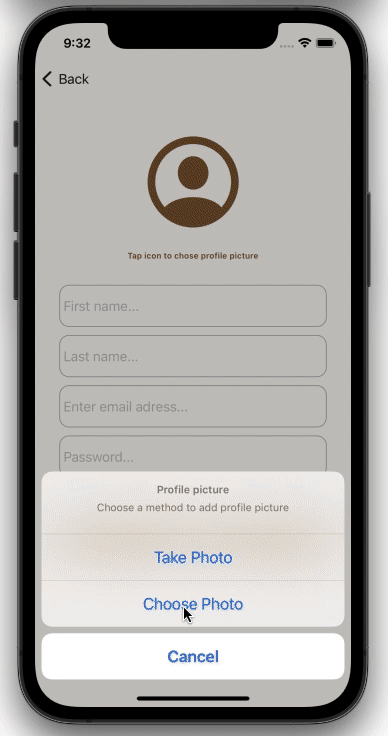
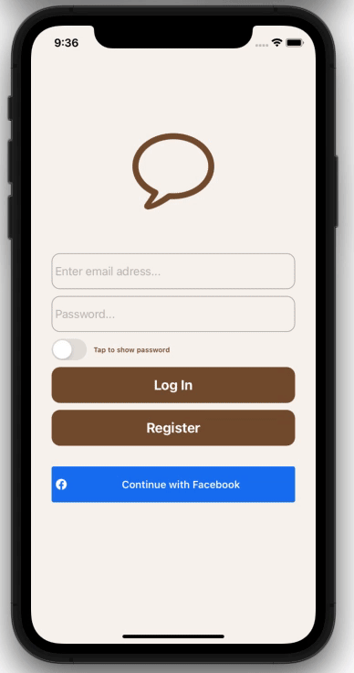

<p align="center">
   <br>
  <h1 align='center' margin-top=0px paddint-top=0px > Chatter </h1>
</p>

<p align="center">
Simple real time chat app written in Swift 5 using Firebase
</p>
<br>
<p align="center">
<h2 align="center"> Real time conversation example </h2>
</p>
<p align="center">

</p>
<br>
<p align="center">
<h2 align="center"> Creating a user with Firebase and Facebook Authentication </h2>
</p>
<p align="center">

 
</p>

## Features
- Facebook  Log In
- Authorization 
- Photo Messages
- Video Messages
- Real Time Conversations
- Location Messages
- Search for Users
- Deleting Conversations
- User Profile

## Requirements
1. [Xcode](https://developer.apple.com/xcode/)
2. [CocoaPods](http://cocoapods.org/)

## Set Up
Clone GitHub repository
```
git clone git@github.com:menescots/Messenger.git
```
Install Pods 
```
pod install
```
Open a project 
```
open Messenger.xcworkspace
```
Build the project (⌘+B) and check for any errors. <br>
Run the app (⌘+R) and test it.

## License

Chatter is under MIT license. See the [LICENSE](LICENSE) file for more info.
